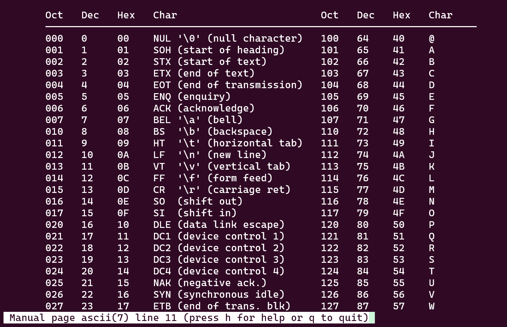
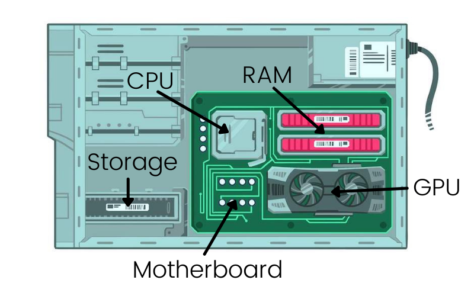
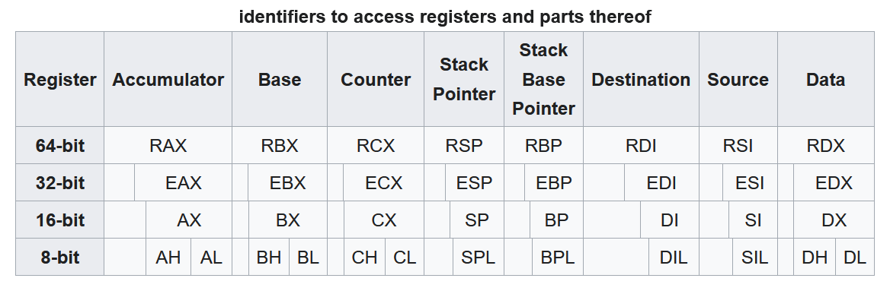
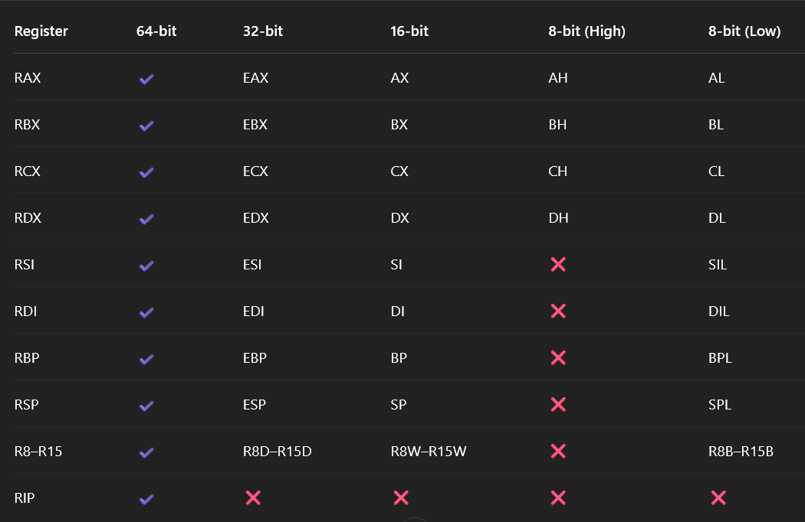
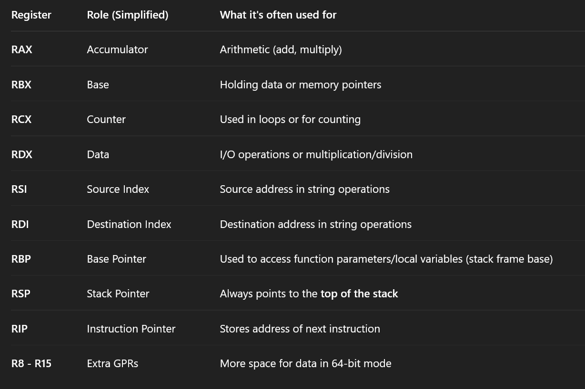
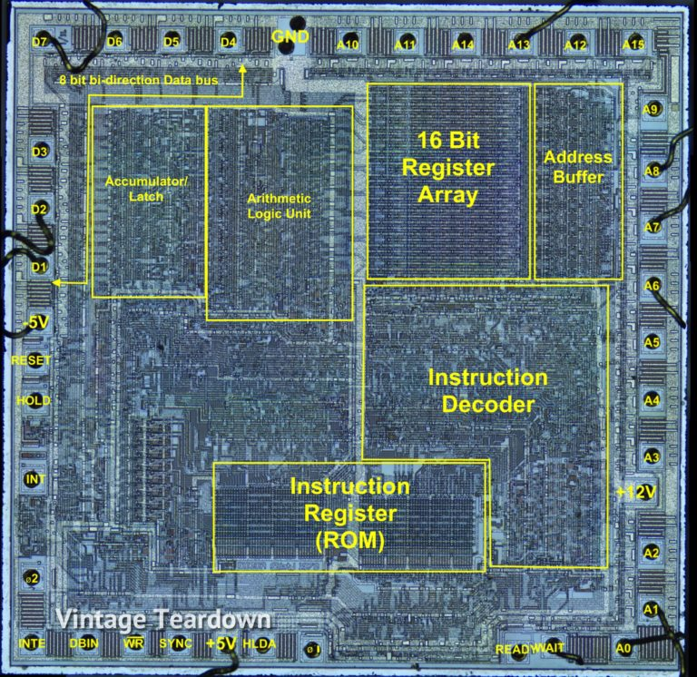
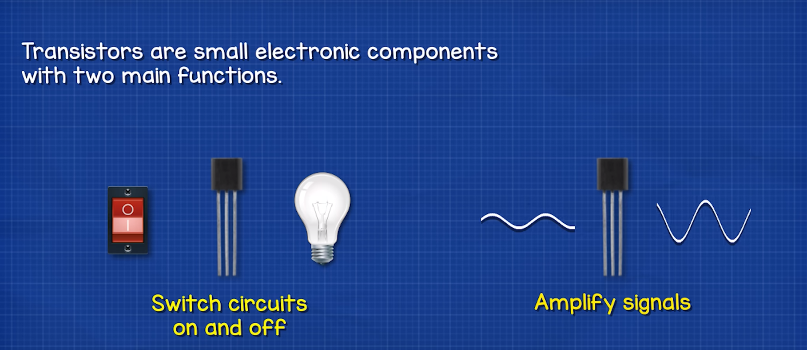
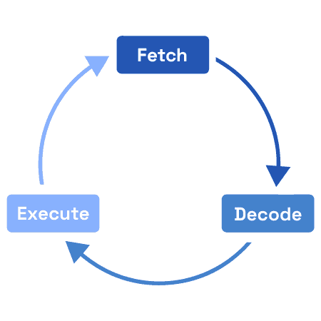

# Reverse Engineering: What to Know First

[Watch the session on youtube](https://www.youtube.com/watch?v=La2XZP9Krm4&t=1679s)


### **DECIMAL NUMBER SYSTEM**

The **decimal number system** is a **base 10** number system having **10 digits** from **0 to 9**. This means that any numerical quantity can be represented using these 10 digits.

The decimal number system is also a **positional value system**. This means that the **value of digits depends on their position** in the number.

‍

**The decimal number 1234 consists of:**

* 4 in the **units** position,
* 3 in the **tens** position,
* 2 in the **hundreds** position,
* 1 in the **thousands** position.

```yaml
1234 = (1 × 1000) + (2 × 100) + (3 × 10) + (4 × 1)
     = (1 × 10³) + (2 × 10²) + (3 × 10¹) + (4 × 10⁰)
```

‍

```yaml
Position -->	10³	 10²  10¹  10⁰
Digits:	 -->    1	 2	  3	    4

    4 × 10⁰ = 4

    3 × 10¹ = 30

    2 × 10² = 200

    1 × 10³ = 1000

Total = 1000 + 200 + 30 + 4 = 1234
```

‍

### **BINARY NUMBER SYSTEM**

Each **binary digit** is also called a **bit**.

The binary number system is a **base 2** system. That means it only uses **two digits**:  
**0 and 1**

It is also a **positional value system**, where each digit has a value expressed in **powers of 2**.

```yaml
    2⁴     2³     2²     2¹     2⁰
   -------------------------------------
    1      1      0      1      0      ← Binary number (11010)
MSB                              LSB
```

In any binary number the rightmost digit is called least significant bit<span data-type="text" style="color: var(--b3-font-color10);"> (LSB)</span> and leftmost digit is called the most significant bit <span data-type="text" style="color: var(--b3-font-color10);">(MSB)</span>

* The **leftmost bit** (here, the first 1) is the **MSB** → it has the highest weight (2⁴ \= 16).
* The **rightmost bit** (here, the last 0) is the **LSB** → it has the lowest weight (2⁰ \= 1).

‍

Convert it into decimal

```yaml
= 1×2⁴ + 1×2³ + 0×2² + 1×2¹ + 0×2⁰
= 16 + 8 + 0 + 2 + 0
= 26₁₀
```

‍

There is Octal Number System As well which you can search on internet and learn.  
we will move to Hexadecimal Number System Because that is relevant to Reverse engineering point of view

**Hexadecimal Number System**

* **Base:**  16
* **Digits Used:**

```mathematica
0, 1, 2, 3, 4, 5, 6, 7, 8, 9,
A, B, C, D, E, F

Letters A–F represent values 10 to 15
A = 10, B = 11, C = 12, D = 13, E = 14, F = 15
```

‍

Let’s convert `2A₁₆`​ to **decimal**:

```mathematica
2A₁₆  = (2 × 16¹) + (A × 16⁰)
      = (2 × 16) + (10 × 1)
      = 32 + 10
      = 42₁₀
```

Hex Position Weights (Just like binary and decimal

```mathematica
Power of 16:    16¹     16⁰
Hex Digit  :    2       A
Value      : 16 x 32 + 1 X 10  =  42
```

‍

### **What is ASCII?**

**ASCII** stands for **American Standard Code for Information Interchange**

**ASCII** stands for **American Standard Code for Information Interchange**.

* It's a **standard** way to represent **text (characters)**  as **numbers** in computers.
* Each character (<span data-type="text" style="color: var(--b3-font-color10);">like A, b, 1, @, space, etc.</span>) has a **unique number**.
* These numbers are usually written in **decimal**, **binary**, or **hex**.

‍



When you type A, your computer stores the **binary number 01000001**, which is **65 in decimal**.

‍

## What is **Unicode**?

**Unicode** is a **universal character encoding standard** that assigns a unique number (code point) to **every character** from **every language**, symbol, or emoji — regardless of platform, device, or program.

<span data-type="text" style="color: var(--b3-font-color10);">Why Unicode came? (ASCII Limitations)</span>

It works fine for:

English letters (A–Z, a–z)

Numbers (0–9)

Basic symbols (@, #, \$, %, etc.)

But fails for:

other languages like Hindi (नमस्ते), Arabic (سلام), Chinese (你好), Tamil (வணக்கம்)

Special symbols, emojis, or math signs (π, √, ≤)

‍



reference : [https://www.linkedin.com/pulse/do-you-know-anything-motherboard-cpu-gpu-ram-types-storage-akhmedov/](https://www.linkedin.com/pulse/do-you-know-anything-motherboard-cpu-gpu-ram-types-storage-akhmedov/)

‍

**Ram** : The most commonly known component is Random Access Memory (RAM). RAM is volatile memory that loses  
the information it holds when its host is powered off.

‍

```pgsql
Year	Processor	Bit Width	Notable Feature
1971	Intel 4004	4-bit	First microprocessor
1974	Intel 8080	8-bit	Used in early PCs
1978	Intel 8086	16-bit	Birth of x86 architecture
1985	Intel 80386	32-bit	True multitasking & 4GB RAM
2003	AMD64 / Intel 64	64-bit	Large memory & modern OS support
```

[Where are registers and what do they look like?](https://electronics.stackexchange.com/questions/476334/where-are-registers-and-what-do-they-look-like)



‍



<span data-type="text" style="color: var(--b3-font-color10);">R8–R15 only have </span>**low 8-bit**<span data-type="text" style="color: var(--b3-font-color10);"> access</span>

```mathematica
+----------------------------------------------------------+
|                        RAX (64 bits)                     |
+-------------------------------+--------------------------+
|         Upper 32 bits         |        EAX (32 bits)     |
|                               +------------+-------------+
|                               |   AX (16)  |             |
|                               +-----+------+             |
|                               | AH  | AL   |             |
|                               +-----+------+             |
+-------------------------------+--------------------------+
```

‍



‍



Reference: [https://electronics.stackexchange.com/questions/476334/where-are-registers-and-what-do-they-look-like](https://electronics.stackexchange.com/questions/476334/where-are-registers-and-what-do-they-look-like)

‍

A **register** is a very small amount of **very fast memory** inside a CPU that temporarily holds data or addresses while the processor works on them

The above image is referring to the **Intel 8080A chip**, which is a **vintage 8-bit microprocessor**. Back then, everything was more visible and understandable because the design was simpler and more compact.

That  **“16-bit Register Array”**  box you see?

<span data-type="text" style="color: var(--b3-font-color10);">That whole area is filled with </span>**flip-flops**<span data-type="text" style="color: var(--b3-font-color10);"> —( special circuits made of </span>**transistors**<span data-type="text" style="color: var(--b3-font-color10);">.)</span>

**What is a Flip-Flop?**

Think of a **flip-flop** as a tiny memory cell. It can store **just 1 bit** of data — either a `0`​ or a `1`​.  
Kind of like a **tiny switch** that can be ON (`1`​) or OFF (`0`​).

‍

**flip flops are made using transistors**



Learn more about transistors : [https://www.youtube.com/watch?v=AwXp6jVaTV4](https://www.youtube.com/watch?v=AwXp6jVaTV4)

‍

**What type of transistor is in a CPU?**

Read here:  [https://www.quora.com/What-type-of-transistor-is-in-a-CPU](https://www.quora.com/What-type-of-transistor-is-in-a-CPU)

‍

**An n-bit register requires n flip-flops to store n bits of data.** 

Therefore, an 8-bit register needs 8 flip-flops, and a 16-bit register needs 16 flip-flops, same goes for 32 and 64 bits .

Each flip-flop is responsible for storing a single bit of data.

```pgsql
+-------------+-------------+-------------+-------------+-------------+-------------+-------------+-------------+
| Flip-Flop 1 | Flip-Flop 2 | Flip-Flop 3 | Flip-Flop 4 | Flip-Flop 5 | Flip-Flop 6 | Flip-Flop 7 | Flip-Flop 8 |
|   (Bit 0)   |   (Bit 1)   |   (Bit 2)   |   (Bit 3)   |   (Bit 4)   |   (Bit 5)   |   (Bit 6)   |   (Bit 7)   |
+-------------+-------------+-------------+-------------+-------------+-------------+-------------+-------------+
+-------------+-------------+-------------+-------------+-------------+-------------+-------------+-------------+
| Flip-Flop 9 | Flip-Flop10 | Flip-Flop11 | Flip-Flop12 | Flip-Flop13 | Flip-Flop14 | Flip-Flop15 | Flip-Flop16 |
|   (Bit 8)   |   (Bit 9)   |   (Bit10)   |   (Bit11)   |   (Bit12)   |   (Bit13)   |   (Bit14)   |   (Bit15)   |
+-------------+-------------+-------------+-------------+-------------+-------------+-------------+-------------+

```

→ Together, they form a **16-bit Register**

‍

Let’s take the **8-bit hexadecimal value**: 0x3A

​`0x3A`​ \= `0011 1010`​ (in binary)

Each bit goes into 1 flip-flop:

```pgsql
+-------------+-------------+-------------+-------------+-------------+-------------+-------------+-------------+
| Flip-Flop 1 | Flip-Flop 2 | Flip-Flop 3 | Flip-Flop 4 | Flip-Flop 5 | Flip-Flop 6 | Flip-Flop 7 | Flip-Flop 8 |
|     0       |     0       |     1       |     1       |     1       |     0       |     1       |     0       |
+-------------+-------------+-------------+-------------+-------------+-------------+-------------+-------------+

    → Holds 0x3A (8-bit value)
```

‍

Let’s now take a **16-bit hexadecimal value**: **0x1F2B**

**0x1F2B = 0001 1111 0010 1011 (16 bits**)

Each bit goes into a flip-flop:

```pgsql
+-------------+-------------+-------------+-------------+-------------+-------------+-------------+-------------+
| Flip-Flop 1 | Flip-Flop 2 | Flip-Flop 3 | Flip-Flop 4 | Flip-Flop 5 | Flip-Flop 6 | Flip-Flop 7 | Flip-Flop 8 |
|     0       |     0       |     0       |     1       |     1       |     1       |     1       |     1       |
+-------------+-------------+-------------+-------------+-------------+-------------+-------------+-------------+
+-------------+-------------+-------------+-------------+-------------+-------------+-------------+-------------+
| Flip-Flop 9 |Flip-Flop10  |Flip-Flop11  |Flip-Flop12  |Flip-Flop13  |Flip-Flop14  |Flip-Flop15  |Flip-Flop16  |
|     0       |     0       |     1       |     0       |     1       |     0       |     1       |     1       |
+-------------+-------------+-------------+-------------+-------------+-------------+-------------+-------------+

    → Holds 0x1F2B (16-bit value)

```

0x1F2B can be split into:

* High byte: 0x1F
* Low byte: 0x2

‍

**What Are Instructions?** 

In **assembly language**, an **instruction** is a command that tells the CPU to **perform a specific task**, like moving data, doing math, or jumping to another part of the program.

Each instruction generally consists of:

* An **operation code** (opcode) → what to do
* **Operands** → the data to do it with

‍

**Instruction Format Types**

**Zero Address Instructions**

**Used in**: Stack-based machines (not Intel, but useful to know conceptually)

```ascii
┌──────────┐
│  opcode  │
└──────────┘
```

example:

```mathematica
PUSH 5
PUSH 10
ADD       ; pops two values (10, 5) → pushes 15

```

‍

**One Address Instruction**

```mathematica
┌──────────┬─────────────┐
│  opcode  │  operand    │
└──────────┴─────────────┘
```

**Definition**: One operand. The other is implied (usually an accumulator).

```mathematica
 mov eax, 4       ; Load 4 into eax
 mov ebx, 3       ; Load 3 into ebx

 mul ebx          ; eax = eax * ebx → eax = 4 * 3 = 12
```

​​mul with one operand uses **​`eax`​**​ **as implicit first operand**

So mul ebx is like: <span data-type="text" style="color: var(--b3-font-color9);">eax = eax * ebx (but shorter)</span>

‍

**Two Address Instructions (✅ Common in Intel)** 

**Definition**: Two operands. One operand is **source**, the other is **destination**.

```mathematica
┌──────────┬────────────┬────────────┐
│  opcode  │ destination│   source   │
└──────────┴────────────┴────────────┘
```

example:

```mathematica
mov eax, ebx    ; move value of ebx into eax
add eax, 10     ; add 10 to eax
```

‍

**Three Address Instructions**

**Definition**: Three operands. One destination and two sources.

```mathematica
┌──────────┬────────────┬────────────┬────────────┐
│  opcode  │ destination│  source 1  │  source 2  │
└──────────┴────────────┴────────────┴────────────┘
```

**Not directly used in Intel**, but <span data-type="text" style="color: var(--b3-font-color10);">found in  </span>**RISC**<span data-type="text" style="color: var(--b3-font-color10);"> architecture</span>.

example:

```mathematica
add r3, r1, r2   ; r3 = r1 + r2
```

‍

  **Fetch, decode and execute Cycle**



[https://github.com/rivian96/reverse-engineering/tree/main/simple-emulators/fetch-decode-execute](https://github.com/rivian96/reverse-engineering/tree/main/simple-emulators/fetch-decode-execute)

‍

**Decompilation and Disassembl**<span data-type="text" style="font-size: 20px;">y</span>

D**isassembling** is the process of converting **machine code (binary)**  back into **assembly instructions**.

```c
0x0000555555555169 <+0>:    55               push   rbp
0x000055555555516a <+1>:    48 89 e5         mov    rbp,rsp
0x000055555555516d <+4>:    48 83 ec 20      sub    rsp,0x20

```

‍

Before understanding decompilation or disassembly its important that we get ourselves familiar with the compilation process

**Compilation Process**

```pgsql
                          +-------------------------+
                          |  Source code (.c) file  |
                          +------------+------------+
                                       |
                                       v
       +-------------------------------+-------------------------------+
       |                   THE COMPILATION PROCESS                     |
       |                                                               |
       |   +------------------+                                        |
       |   |  Pre-Processor   |      Handles directives like #include  |
       |   +--------+---------+      and #define. Removes comments.    |
       |            |                                                  |
       |            v                                                  |
       |   +------------------+        +---------------------------+   |
       |   |     Compiler     |------>|    Assembly code (.s)     |    |
       |   +--------+---------+        +---------------------------+   |
       |            |                  Converts preprocessed code      |
       |            v                  into assembly instructions.     |
       |   +------------------+                                        |
       |   |     Assembler     |---------+                             |
       |   +--------+---------+          |                             |
       |            |                    |                             |
       |            v                    v                             |
       |   +------------------+     +----------------------+           |
       |   |      Linker       |<---|   Object file (.o)   |           |
       |   +--------+---------+     +----------------------+           |
       |            ^                 Assembler Converts assembly to   |
       |            |                  machine code. Output = .o       |
       |     +------+-------+                                          |
       |     |   Libraries  |     Linker Links external libraries and  |
       |     +--------------+        functions with object file.       |
       +-------------------------------+-------------------------------+
                                       |
                                       v
                            +-------------------------+
                            |    Executable file      |
                            +-------------------------+
                               Final binary ready
                               to run on the system

```

[https://github.com/rivian96/reverse-engineering/blob/main/compilation-stages.md](https://github.com/rivian96/reverse-engineering/blob/main/compilation-stages.md)

‍

**Decompilation**

Decompilation is the process of converting compiled code (usually in binary or machine code format) back into a higher-level programming language that is more understandable for humans. It's the reverse of compilation, which transforms source code into machine-readable code.

```c
#include <stdio.h>

int add(int a, int b) {
    return a + b;
}

int main() {
    int sum = add(3, 4);
    printf("Sum: %d\n", sum);
    return 0;
}

```

‍

**What is Debugging**   **?** 

Debugging is the process of finding and fixing errors in a program that cause it to behave incorrectly or crash. It helps developers understand why the code isn't working and lets them step through the program to solve the problem.

**Debugging** in binary exploitation and reverse engineering is about using tools (like GDB) to step through a program's execution, inspect its memory, and find weaknesses (e.g., buffer overflows, improper input handling) that can be exploited to gain control over the program.

‍

Simple Linux Assembly Boilerplate (for 64-bit)

```pgsql
section .text
    global _start        ; tells linker where the entry point is

_start:
    ; your code goes here
    ; example: exit program

    mov eax, 60          ; syscall number for exit
    xor edi, edi         ; exit code 0
    syscall              ; make the system call


section .data
    ; data (strings, variables) goes here

section .bss
    ; uninitialized data goes here
```

‍

Lets take a very basic Example of adding Two Numbers

```pgsql
section .text
    global _start

_start:
    ; Step 1: Add two numbers (5 + 3)
    mov rax, 5      ; Load 5 into RAX
    add rax, 3      ; Add 3 to RAX (RAX = 5 + 3 = 8)

    ; Step 2: Subtract two numbers (10 - 4)
    mov rbx, 10     ; Load 10 into RBX
    sub rbx, 4      ; Subtract 4 from RBX (RBX = 10 - 4 = 6)

    ; Program exit
    mov rax, 60     ; syscall number for exit
    xor rdi, rdi    ; return code 0
    syscall         ; exit(0)

section .data
    ; Nothing for now – we use registers only
```

‍
